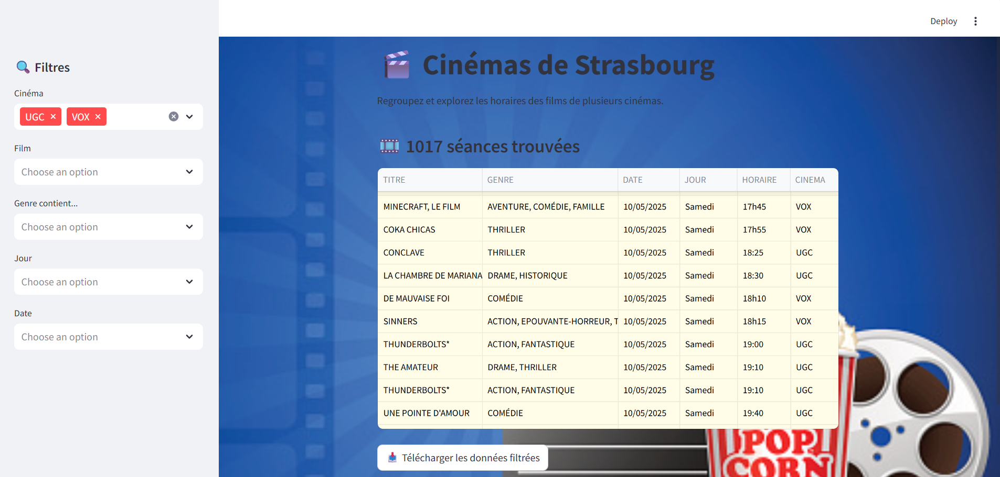

# 🎬 Strasbourg Cinema Dashboard

An interactive Streamlit web app that aggregates and visualizes movie schedules from multiple Strasbourg cinemas. It helps users explore current movies by genre, cinema, or date — all in one dashboard.

---

## ✨ Features

- Scrapes movie data from multiple cinema websites
- Cleans and standardizes genre information
- Displays results in an interactive dashboard
- Allows filtering by cinema, film, genre, day, and date
- Download the filtered results as a CSV
- Customized styling with background and color themes

---

## 🛠️ Installation

Clone the repository and install the dependencies:

```bash
git clone https://github.com/Nidals17/Strasbourg-Cinema-project.git
cd Strasbourg-Cinema-project
pip install -r requirements.txt

```

## 🚀 Run the Dashboard

``` 
streamlit run app.py

```

## 📁 Project Structure

```bash
Vox-Cinema-project/
│
├── app.py                  # Main Streamlit app
├── data_movies/            # Folder containing CSV files with scraped data and background files
├── scraping/               # Folder containing scrapers for each cinema
│   ├── Scraping_VOX.py     # Scraper for Vox cinema
│   ├── Scraping_UGC.py     # Scraper for UGC cinema
│   └── Scraping_Cinestar.py # Scraper for Cinestar cinema
├── requirements.txt        # Python dependencies
└── README.md               # This file
```

## 👤 Author

Developed by Nidal Souk 

## 📸 Dashboard Preview




